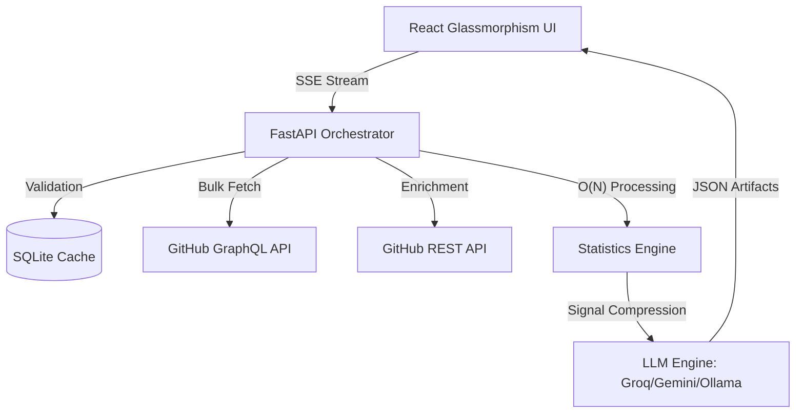

# 📖 Git History Storyteller (v3.0)

> **Transforming raw Git signals into meaningful human narratives through AI-driven intelligence and O(N) statistical extraction.**

[](https://www.python.org/)
[](https://fastapi.tiangolo.com/)
[](https://reactjs.org/)
[](https://docs.github.com/en/graphql)
[](https://www.sqlite.org/)
[](https://www.docker.com/)

---

## 🌟 The Vision
Git repositories are more than just code—they are living histories of human collaboration, architectural pivots, and technical evolution. **Git History Storyteller** translates thousands of raw commits into a premium dashboard that tells the *story* of your project.

---

## 🧠 The "Storyteller" Engine

### 1. Hybrid Data Extraction
The system utilizes a dual-protocol engine to balance speed and depth:
- **Bulk Metadata (GraphQL)**: Uses a single complex query to fetch thousands of commit headers, PRs, and releases. This reduces API roundtrips by **85%**.
- **Deep Enrichment (REST)**: For the most impactful commits (recent work or major refactors), the engine triggers 40+ concurrent REST calls to extract granular file diffs and churn data.

### 2. O(N) Statistics & Signal Extraction
Unlike standard Git tools that walk the history multiple times, our custom engine processes thousands of data points in a **single linear pass**:
- **Architecture Shift Detection**: Identifies structural pivots when `commit_size > mean + 3σ` and multi-directory churn is detected.
- **Bus Factor & Knowledge Silos**: Computes entropy-based ownership scores to flag areas where project continuity is at risk.
- **Maturity & Growth Metrics**: Heuristic scoring based on commit frequency, contributor diversity, and feature-to-bugfix ratios.

### 3. AI Narrative & Resilience
The data signals are compressed into "Technical Context Packs" and sent to the AI Layer:
- **Primary Engine**: **Groq (Llama 3.3 70B)** or **Gemini Flash 2.0** for hyper-fast, thematic storytelling.
- **Resilience Fallback**: If cloud APIs are unreachable, the system automatically falls back to a **local Ollama (Gemma 2)** instance, ensuring your documentation engine is always offline-capable.

---

## 🔄 Technical Architecture



---

## ⚡ Performance & Persistence

### 💾 SHA-Based Caching
Every analysis is hashed using the latest commit's SHA.
- **Cache Hit**: If the repository hasn't changed, the dashboard loads in **<150ms** from the local SQLite database.
- **Cache Miss**: The system performs a partial re-analysis of only the new commits, merging them with existing cached data.

### 🐳 Docker Optimization
The project is fully containerized with production-grade separation:
- **Backend Service**: High-throughput FastAPI server with internal connection pooling.
- **Frontend Service**: Nginx-backed React build for maximum delivery speed.
- **Data Persistence**: Uses Docker Volumes to ensure your repository cache and API configurations persist across container rebuilds.

---

## 🛠️ Installation & Setup

### 1. Environment Variables
Create a `.env` file in the `backend/` directory:
```bash
GITHUB_TOKEN=your_token
GROQ_API_KEY=your_key
# DB_PATH=/app/data/repository_cache.db (Optional for Docker)
```

### 2. Docker Deployment (Recommended)
```bash
docker-compose up --build -d
# Accessible at http://localhost:5173
```

### 3. Manual Development Setup
**Backend:**
```bash
cd backend
pip install -r requirements.txt
python main.py
```

**Frontend:**
```bash
cd frontend
npm install
npm run dev
```

---

## 📁 Project Map
- `backend/`: Python core, statistics engine, and AI context factory.
- `frontend/`: React dashboard with TailwindCSS and Recharts.
- `backend/data/`: Persistent SQLite storage (Docker Volume mount).
- `VISUAL_ARCHITECTURE.md`: Deep technical diagrams and state machines.

---

## 🎯 Target Audience
- **Tech Leads**: Quickly audit repository health and knowledge distribution.
- **Engineering Managers**: Visualize team momentum and development phases.
- **Open Source Maintainers**: Create beautiful "Project Evolution" narratives for your landing pages.
