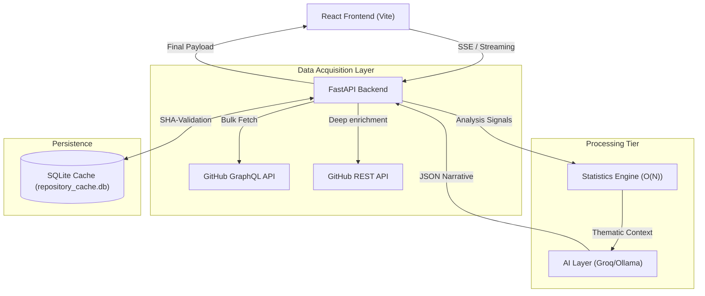
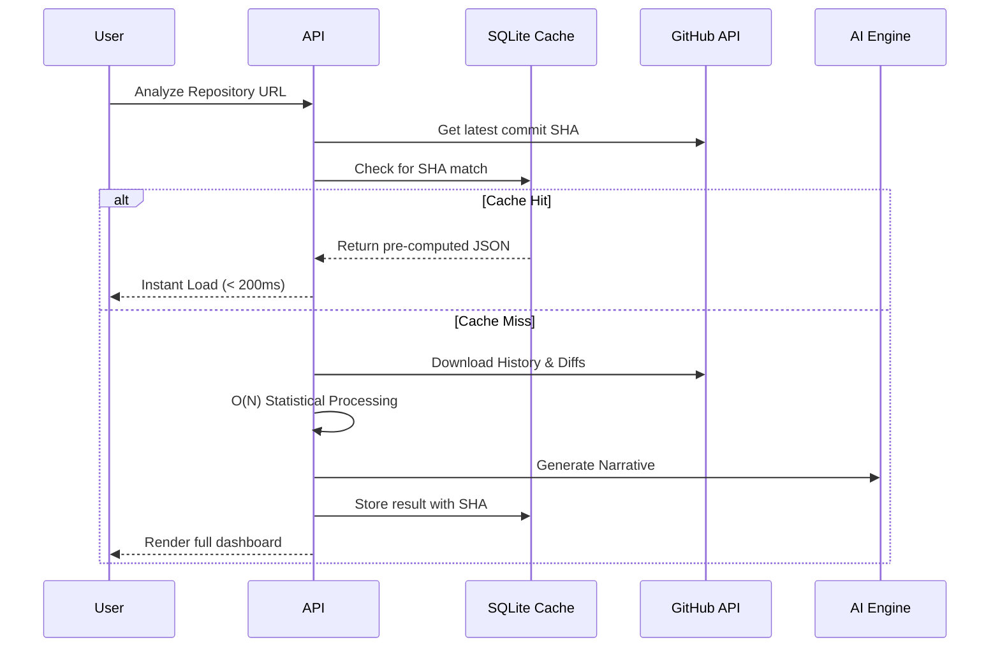
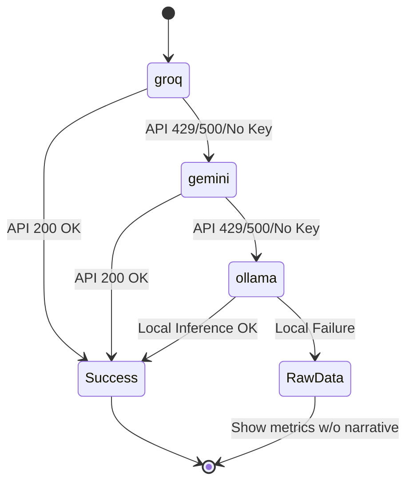

# 🏗️ Visual Architecture

Detailed documentation of the technical workflows and architectural patterns powering **Git History Storyteller**.

## 1. High-Level System Architecture
The system follows a decoupled asychronous pattern designed for high throughput and resilience.

## 2. Request Lifecycle (Fast Path vs Cold Path)
This diagram illustrates how the SHA-based caching mechanism handles requests.

## 3. AI Resilience & Fallback Logic
The system is designed to provide intelligence even when cloud services fail.

---

## 4. Key Architectural Decisions

### Why GraphQL + REST?
GraphQL provides the high-level history and PR metadata in a single round-trip. However, REST is used for commit enrichment because GitHub's GraphQL implementation has stricter complexity limits for individual file diffs. This hybrid approach yields the best performance.

### Why O(N) Processing?
The `StatisticsEngine` uses single-pass iterations to compute metrics like code churn, bus factor, and hotspots simultaneously. This prevents the "Walking Dead" problem where complexity grows exponentially with repository size.

### Docker Volume Persistence
By mounting `./backend/data:/app/data`, we ensure that your analyzed repository history survives even when the containers are destroyed and rebuilt (`docker-compose down`).
